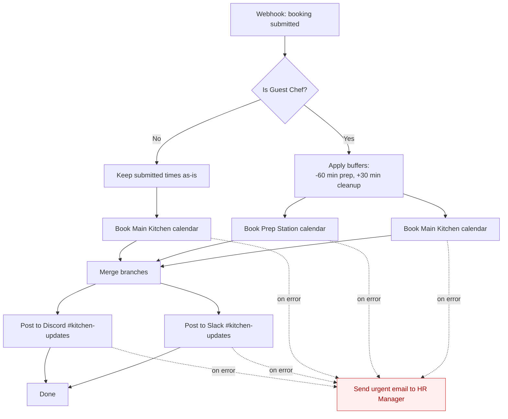

# Logic Flow — Why Each Decision Exists

This document explains the workflow's decision points in plain English. Every branch, buffer, and fallback exists for a reason. Understanding the *why* is what keeps the automation elegant — and what lets future maintainers change it safely.

## Flowchart

---

## Decision 1: Is this a Guest Chef or a Regular?

**Where**: The `IF` node named **Is Guest Chef?** immediately after the webhook.

**Rule**: Route on the `visitorType` field. `"Guest Chef"` goes one way; anything else goes the other.

**Why it exists**: Guest Chefs and Regulars have fundamentally different operational needs. A Regular staff member booking a 30-minute lunch demo does not need the Prep Station, nor an hour of setup time. A Guest Chef almost always does. Mixing them into a single flow would either over-book resources (wasting Prep Station availability for people who don't need it) or under-book (leaving Guest Chefs without prep time). One clean boolean decision keeps the rest of the workflow simple.

**Why only two types**: Two covers the real-world cases today. If a third visitor class emerges (e.g., "External Caterer"), this node becomes a `Switch` rather than an `IF` — a small change, not a rewrite.

---

## Decision 2: Apply a -60 / +30 minute buffer for Guest Chefs

**Where**: The `Function` node named **Apply Chef Buffers** on the Guest Chef branch.

**Rule**: Subtract 60 minutes from the submitted start time; add 30 minutes to the submitted end time.

**Why -60 before the start**: Guest Chefs bring their own ingredients, equipment, and plating. Sixty minutes is the kitchen manager's observed average for mise en place before service. Booking the calendar from *their* perceived start time rather than the actual service time would cause collisions with whoever uses the kitchen earlier that day.

**Why +30 after the end**: Deep-clean time. Guest Chefs leave more mess than regulars (stocks, reductions, specialty oils). Thirty minutes lets staff clean before the next booking can start.

**Why it's done in the workflow, not the form**: The form stays simple for the submitter — they enter *service* times, not logistics times. The automation does the mental math. This prevents user error and keeps the policy in one place. If the buffer ever changes from 60/30 to 90/45, we edit one node, not a form.

---

## Decision 3: Book two calendars for Guest Chefs, one for Regulars

**Where**: The two `Google Calendar` nodes on the Guest Chef branch, and the single node on the Regular branch.

**Rule**:
- Guest Chef -> Main Kitchen **and** Prep Station.
- Regular -> Main Kitchen only.

**Why separate calendars instead of one "kitchen" calendar**: The Main Kitchen and Prep Station are two physically distinct rooms that can be used independently. Modelling them as separate calendars lets the facilities team see availability per-room and lets other workflows (cleaning rota, maintenance) read one without the noise of the other.

**Why parallel, not sequential**: The two bookings have no dependency on each other. Running them in parallel is twice as fast and — more importantly — lets each branch raise its own error independently. If the Prep Station booking fails, we still know the Main Kitchen succeeded.

---

## Decision 4: Merge before notifying

**Where**: The `Merge` node just before the Slack and Discord nodes.

**Rule**: Wait for *all* upstream calendar bookings to complete, then fire notifications once.

**Why merge at all**: Without it, a Guest Chef would trigger *two* Slack messages (one per calendar branch). The team does not want duplicates. The merge reunites the branches into a single downstream message.

---

## Decision 5: Notify Slack and Discord in parallel

**Where**: The `Slack` and `Discord` nodes after the merge.

**Rule**: Post the same confirmation to both channels at the same time.

**Why both**: Different parts of the org live in different tools. Kitchen porters read Discord; management reads Slack. Posting to both guarantees visibility without forcing anyone to switch platforms.

**Why parallel**: They are independent. A failure in one should not block the other — and each gets its own error handler (see Decision 6).

---

## Decision 6: On any failure, email the HR Manager urgently

**Where**: The `Email` node wired to the **error output** of every external-API node (calendars, Slack, Discord).

**Rule**: If any node errors, send an email with the failing step, the original payload, and the error message.

**Why HR specifically**: In this org, HR owns visitor relations. A failed booking is not just a technical issue — it means a human (often an external Guest Chef) will arrive to a kitchen that isn't actually reserved. HR is the party responsible for smoothing that over and must know *immediately*, not at the next log review.

**Why email, not Slack**: Slack might be the *thing that's broken*. Email uses an independent SMTP path, so the alert survives even when our chat tools are down. Email also creates a permanent, searchable record that is easy to escalate.

**Why "urgent" in the subject**: HR receives many automated emails. A consistent, machine-prefixed subject (`URGENT: Kitchen Booking Failure`) lets them filter, route, and triage without reading the body first.

---

## Design Principles Behind the Whole Flow

1. **One policy, one place** — Buffer durations, channel names, and HR email are all set in a single `Config` node / env vars, never hard-coded in multiple nodes.
2. **Fail loud, fail to a human** — Silent failures are worse than noisy ones. Every external call has an error path that reaches a person.
3. **Parallelism where safe, merge where needed** — Independent work runs concurrently; dependent work waits.
4. **Form stays dumb, workflow stays smart** — End-users submit natural times; the automation handles logistics.
5. **Two calendars mirror two rooms** — The data model matches the physical world, so humans and machines agree on what's booked.

> 💡 **Elegance test**: If a new hire in Operations can read this document and predict what happens for any given form submission, the workflow is elegant. If not, the flow — or this doc — needs another pass.

